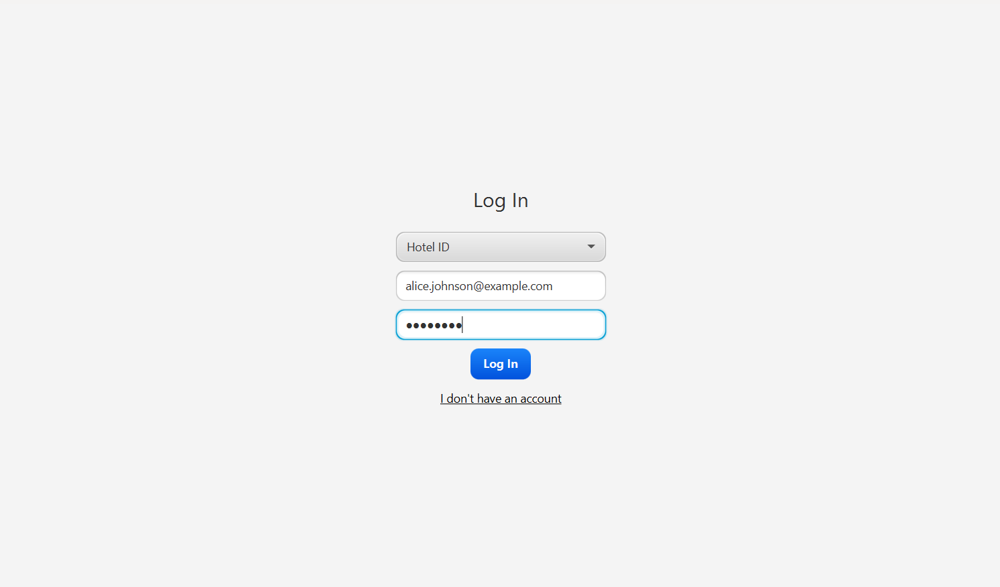
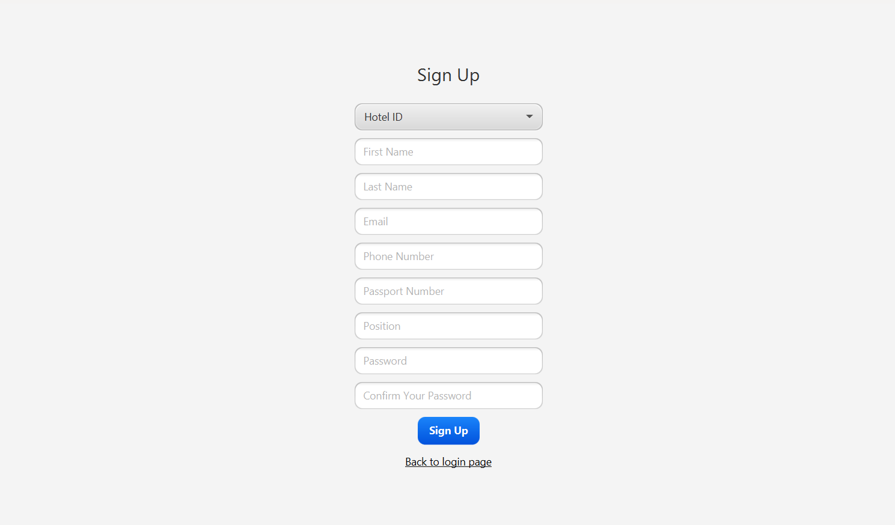
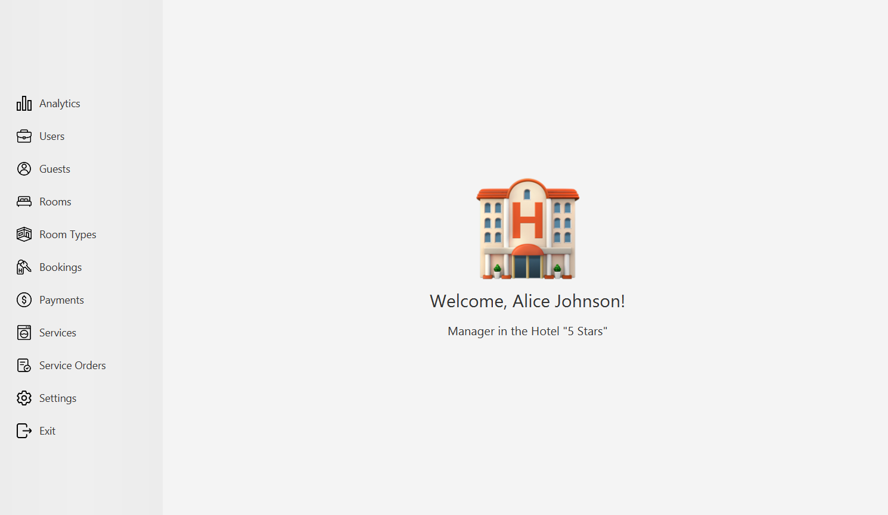
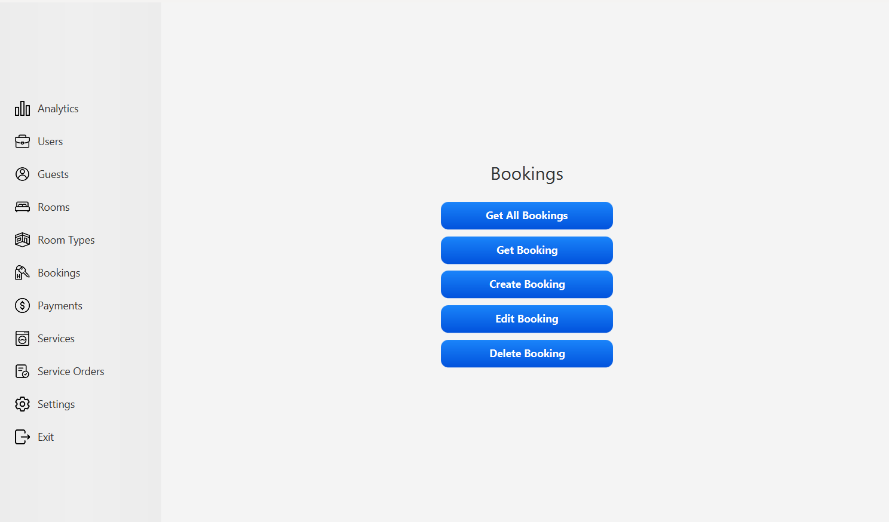
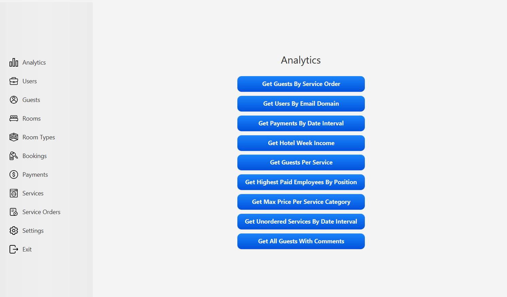
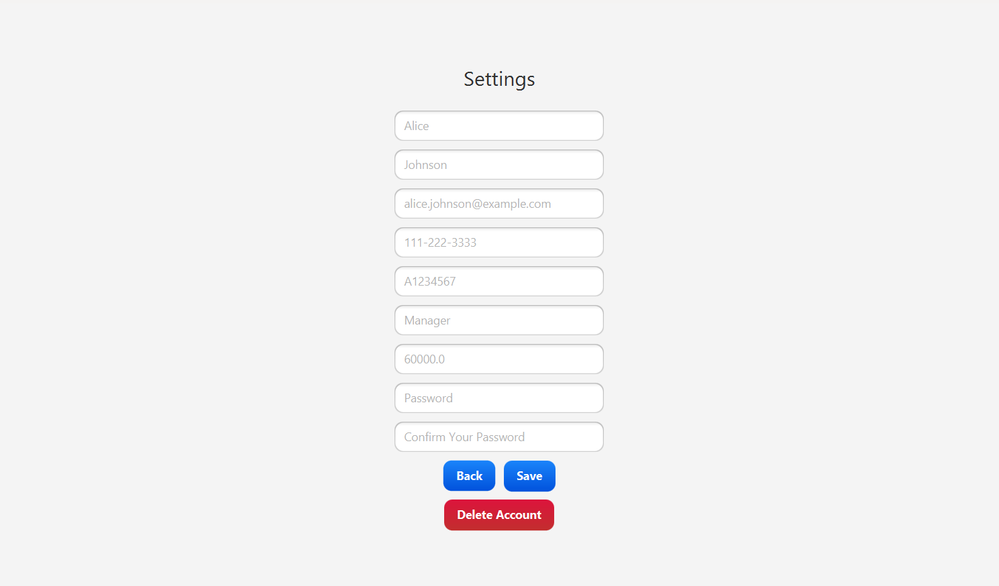

## Hotel Management System
This application has been developed as a course project to streamline hotel operations by automating various processes such as booking management, customer check-in/check-out, room availability, billing, reporting and analytics.

## Screenshots
### Login Page

### Signup Page

### Homepage

### Control Panel

### Analytics Page

### Settings Page

## Hotkeys
| Hotkey   | Function                                                           |
|----------|--------------------------------------------------------------------|
| `ENTER`  | Execute various operations such as get, create, save, or delete.   |
| `CTRL+B` | Navigate to previous page.                                         |
| `CTRL+D` | Delete the current user account.                                   |
| `CTRL+Q` | Exit the application.                                              |